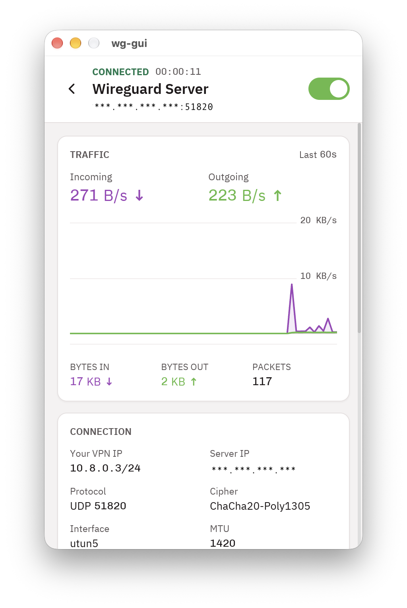

# wg-gui: WireGuard VPN Client for macOS

wg-gui is a free and open source WireGuard VPN client for Mac. It lets you import a WireGuard `.conf` file and connect to your VPN with one click. It has a small app window and an icon in the menu bar. It runs on macOS 13 Ventura or newer, on Apple Silicon (M1, M2, M3, M4) and Intel Macs.



## Features

- Import WireGuard `.conf` files by drag and drop
- Create a new WireGuard profile and generate keys in the app
- Connect and disconnect with one click
- See live upload and download speed while connected
- Menu bar icon that shows when the VPN is on
- Light and dark mode
- Reconnects by itself when your Wi-Fi or network drops and comes back
- Includes `wg-cli`, a WireGuard command line tool for the terminal
- Written in Rust, with its own WireGuard code. It does not need wireguard-tools, wireguard-go or the Mac App Store.

## Requirements

- macOS 13 Ventura or newer
- Apple Silicon or Intel Mac
- An admin password (the VPN helper needs admin rights)

## How to install wg-gui on macOS from source

Open the Terminal app and run:

```sh
git clone https://github.com/nzahasan/wg-gui.git
cd wg-gui
scripts/install.sh
```

The script installs anything the build needs (Xcode Command Line Tools, Homebrew and Rust), builds the app and puts it in your Applications folder. It asks for your password because the VPN helper needs admin rights.

To update later, get the latest code and run the script again:

```sh
git pull
scripts/install.sh
```

## How to uninstall wg-gui

From the `wg-gui` folder, run:

```sh
scripts/install.sh --uninstall
```

Add `--zap` to also delete your saved profiles.

## Questions

### What is wg-gui?

wg-gui is a free WireGuard client for macOS with a simple window and a menu bar icon. You use it to connect your Mac to a WireGuard VPN server.

### Is wg-gui free?

Yes. wg-gui is free and open source under the MIT license.

### Does wg-gui work with any WireGuard server?

Yes. It works with any standard WireGuard `.conf` file that has one `[Peer]` section. This includes files from VPN providers and from your own WireGuard server.

### Does it work on Apple Silicon Macs?

Yes. It works on Apple Silicon (M1, M2, M3, M4) and Intel Macs with macOS 13 Ventura or newer.

### Where are my WireGuard profiles saved?

In `~/.config/wg-gui` in your home folder. Only your user account can read them.

### Can I use it from the terminal?

Yes. Run `sudo wg-cli profile.conf` to connect. Press Ctrl+C to disconnect.

## License

wg-gui is free software under the MIT license. See [LICENSE](LICENSE).
